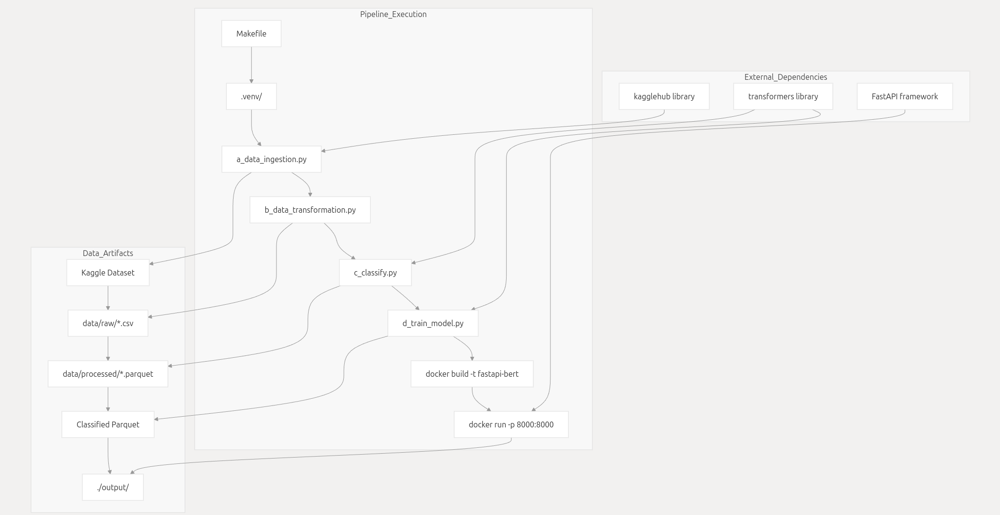
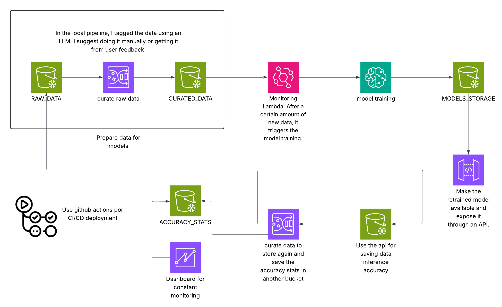

# Getting Started
To execute the complete pipeline:

```bash
make
```
This single command will:

- Set up the Python virtual environment
Install all required dependencies
- Run code quality checks
- Execute the complete data pipeline from ingestion to model training
- Build and deploy the API in a Docker container
- The final API will be available at http://localhost:8000 with classification endpoints ready for real-time inference.

Note: You must have Java 11, PySpark, and Docker pre-installed.
The Makefile sets up only the Python virtual environment using venv.

# ⚠️ WARNING: The run_api target in the Makefile will stop and remove any container using port 8000.
If you're running another service on this port, modify the Makefile accordingly.

# Testing the API
You can test the API by sending a POST request via curl:

`curl -X POST http://localhost:8000/predict -H "Content-Type: application/json" -d '{"text": "Hello Mr Cami"}'`


# System Architecture
The MLE_test repository implements a linear ML pipeline where each stage depends on the previous one's output:



## Orchestration and Deployment
The Makefile provides the primary interface for running the complete pipeline, while Docker handles production deployment:

#### Virtual Environment: Automatically created in .venv/ with all dependencies from requirements.txt
#### Code Quality: Integrated ruff linting before pipeline execution
#### Docker Deployment: Containerized API service on port 8000 with automatic cleanup of existing containers
#### Dependency Isolation: Separate requirements_docker.txt for production API deployment

# Data ingestion
The data ingestion system is implemented as a single Python module that downloads the "thoughtvector/customer-support-on-twitter" dataset from Kaggle. The system is designed to be idempotent, skipping downloads when data already exists locally, and handles the complexity of moving data from Kaggle's temporary download locations to the project's standardized directory structure.

# Data transformation
The data transformation system is implemented as a single Python module that uses PySpark to process Twitter customer support data. The system performs text cleaning, data type conversion, customer-brand relationship identification, and data filtering to prepare the dataset for machine learning tasks.

# Classification
The text classification step uses the Hugging Face transformers library to perform zero-shot classification on customer support tweets. Zero-shot classification allows the system to categorize text without requiring pre-labeled training data by leveraging a model pre-trained on natural language inference tasks.

Classification Categories
The system classifies customer support tweets into five predefined categories:

| Category         | Purpose                                            |
|------------------|----------------------------------------------------|
| billing issue    | Payment, invoicing, and billing-related problems   |
| shipping problem | Delivery, logistics, and shipping concerns         |
| product defect   | Manufacturing defects and product quality issues   |
| customer service | General service inquiries and support requests     |
| other            | Miscellaneous issues not covered by other categories |

pd: in this part of the code we reduced to 100 rows for local testing purposes

# Training model
The model training component follows a standard supervised fine-tuning approach using the Hugging Face Transformers library. The system loads pre-classified data, tokenizes text using BERT tokenizer, and fine-tunes a pre-trained BERT model for sequence classification.

# API and deployment
The API and deployment system transforms the trained BERT model from Model Training into a production-ready web service. The architecture consists of two main components:

 - **FastAPI Application** (e_apification.py) - REST API server that loads the trained model and provides prediction endpoints
 - **Docker Container** (Dockerfile) - Containerized deployment environment with minimal dependencies

# Future Enhancements

 - ✅ Unit and integration tests

 - 📈 Logging and monitoring for the API

 - 🧪 CI/CD pipeline (e.g., GitHub Actions)

 - 🛠️ Retry/timeout logic in data ingestio

# ARQ PROPOSAL
 - Versioning of models and datasets (S3 + MLflow or SageMaker Model Registry).

 - Automatic validation of datasets and models.

 - Structured logging in CloudWatch and continuous monitoring.

 - Separation of environments (dev, qc, prod) with different buckets/job names.

 - CI/CD for models (GitHub Actions or Azure pipelines).

